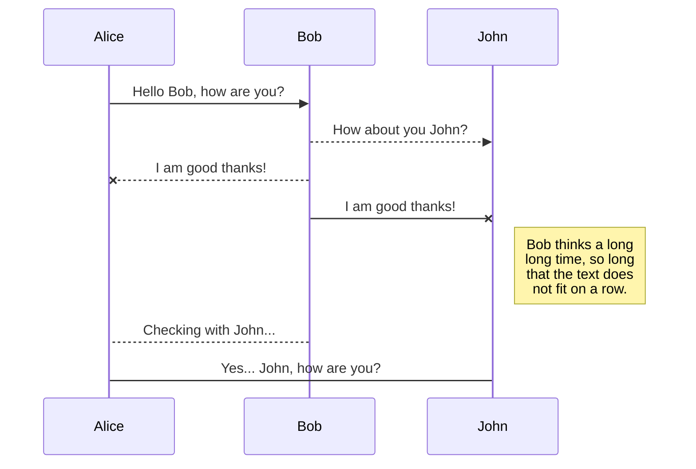
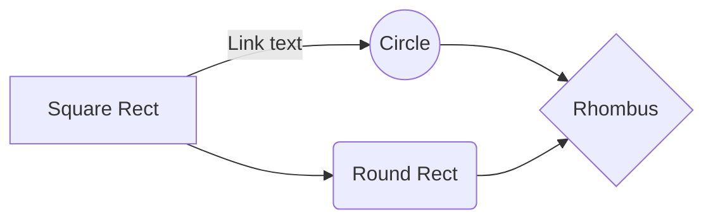

# Installation of vSphere on OCP4
# Pre-Reqs
This repository follows the following article.
[https://blog.openshift.com/deploying-a-user-provisioned-infrastructure-environment-for-openshift-4-1-on-vsphere/](https://blog.openshift.com/deploying-a-user-provisioned-infrastructure-environment-for-openshift-4-1-on-vsphere/)

## Pre-Reqs
### RHCOS OVA

    Import RHCOS OVS into vCenter
    [https://mirror.openshift.com/pub/openshift-v4/dependencies/rhcos/4.2/latest/](https://mirror.openshift.com/pub/openshift-v4/dependencies/rhcos/4.2/latest/)

### Bootstrap / Master / Worker IPs

    export bootstrap_ip=
    export master0_ip=
    export master1_ip=
    export master2_ip=
    export compute0_ip=
    export compute1_ip=
    export compute2_ip=

### HAPROXY ( instead / along with DNS)
yum install -y haproxy

    cat > /etc/haproxy/haproxy.cfg <<EOF
    #---------------------------------------------------------------------
    # Global settings
    #---------------------------------------------------------------------
    global
        # to have these messages end up in /var/log/haproxy.log you will 
        log         127.0.0.1 local2
        chroot      /var/lib/haproxy
        pidfile     /var/run/haproxy.pid
        maxconn     4000
        user        haproxy
        group       haproxy
        daemon
    
       # turn on stats unix socket
       stats socket /var/lib/haproxy/stats
    
    #---------------------------------------------------------------------
    
    #---------------------------------------------------------------------
    defaults
        mode                    http
        log                     global
        option                  httplog
        option                  dontlognull
        option http-server-close
        option forwardfor       except 127.0.0.0/8
        option                  redispatch
        retries                 3
        timeout http-request    10s
        timeout queue           1m
        timeout connect         10s
        timeout client          1m
        timeout server          1m
        timeout http-keep-alive 10s
        timeout check           10s
        maxconn                 3000
    
    #---------------------------------------------------------------------
    
    listen stats
        bind :9000
        mode http
        stats enable
        stats uri /
        monitor-uri /healthz
    
    
    frontend openshift-api-server
        bind *:6443
        default_backend openshift-api-server
        mode tcp
        option tcplog
    
    backend openshift-api-server
        balance source
        mode tcp
        server bootstrap ${BOOTSTRAP_IP}:6443 check
        server master0 ${MASTER0_IP}:6443 check
        server master1 ${MASTER1_IP}:6443 check
        server master2 ${MASTER2_IP}:6443 check
    
    frontend machine-config-server
        bind *:22623
        default_backend machine-config-server
        mode tcp
        option tcplog
    
    backend machine-config-server
        balance source
        mode tcp
        server bootstrap ${BOOTSTRAP_IP}:22623 check
        server master0 ${MASTER0_IP}:22623 check
        server master1 ${MASTER1_IP}2:22623 check
        server master2 ${MASTER2_IP}:22623 check
    
    frontend ingress-http
        bind *:80
        default_backend ingress-http
        mode tcp
        option tcplog
    
    backend ingress-http
        balance source
        mode tcp
        server worker0-http-router0 ${COMPUTE0_IP}:80 check
        server worker1-http-router1 ${COMPUTE1_IP}:80 check
        server worker2-http-router2 ${COMPUTE2_IP}:80 check
    
    frontend ingress-https
        bind *:443
        default_backend ingress-https
        mode tcp
        option tcplog
    
    backend ingress-https
        balance source
        mode tcp
        server worker0-https-router0 ${COMPUTE0_IP}:443 check
        server worker1-https-router1 ${COMPUTE1_IP}:443 check
        server worker2-https-router2 ${COMPUTE2_IP}:443 check
    
    #---------------------------------------------------------------------
    EOF

### DNS ( Can LoadBalance for testing )
    yum install -y named
    cat > /var/named/zonefile.db << EOF
    $ORIGIN apps.upi.example.com. 
    * A  ${COMPUTE0_IP}:
    * A  ${COMPUTE1_IP}:
    * A  ${COMPUTE2_IP}:
    $ORIGIN upi.example.com. 
    _etcd-server-ssl._tcp SRV 0 10 2380 etcd-0 
    _etcd-server-ssl._tcp SRV 0 10 2380 etcd-1 
    _etcd-server-ssl._tcp SRV 0 10 2380 etcd-2 
    bootstrap-0 A ${BOOTSTRAP_IP}
    control-plane-0 A ${MASTER0_IP}
    control-plane-1 A ${MASTER1_IP} 
    control-plane-2 A ${MASTER2_IP}
    api A ${BOOTSTRAP_IP}
    api A ${MASTER0_IP}
    api A ${MASTER1_IP}
    api A ${MASTER2_IP} 
    api-int A ${BOOTSTRAP_IP}
    api-int A ${MASTER0_IP}
    api-int A ${MASTER1_IP}
    api-int A ${MASTER2_IP} 
    etcd-0 A ${MASTER0_IP} 
    etcd-1 A ${MASTER1_IP}
    etcd-2 A ${MASTER2_IP} 
    compute-0 A ${COMPUTE0_IP}
    compute-1 A ${COMPUTE1_IP}
    compute-2 A ${COMPUTE2_IP}
    EOF

## Installation

    git clone git@github.com:hornjason/ocp4-vsphere.git
    cd ocp4-vsphere/
    cp terraform.tfvars.example terraform.tfvars
    cp ocp-4.2/install-config.yaml.example  ocp-4.2/install-config.yaml; cp ocp-4.2/install-config.yaml .
    
    // Install terraform 11.0.2 / jq / openshift-install / openshift-client / 
    // jq is in epel 
    yum install -y https://dl.fedoraproject.org/pub/epel/epel-release-latest-7.noarch.rpm
    yum install -y jq
    // Terraform 11.02 , repo doesn't work with newer versions of terraform
    wget https://releases.hashicorp.com/terraform/0.11.0/terraform_0.11.0_linux_amd64.zip && unzip terraform_0.11.0_linux_amd64.zip -d /usr/local/bin
    // Edit install-config.yaml to generate ignition files
    
    // Edit terraform.tfvars
    
    // Create ignition files
    openshift-installation create ignition-configs --dir ocp-4.2/

    // Run installation
    terraform init .
    terraform apply -auto-approve
    openshift-install --dir ~/vsphere wait-for bootstrap-complete
    terraform apply -auto-approve -var 'bootstrap_complete=true'
    openshift-install --dir ~/vsphere wait-for install-complete
    
    // Remove 
    terraform destroy -auto-approve

git clone [https://github.com/hornjason/ocp4-vsphere](https://github.com/hornjason/ocp4-vsphere)

cd ocp4-vsphere
edit machine/ignition.tf;
change gw = "local gw"
change DNS1 = "dns server"
## terraform.tfvars

     // ID identifying the cluster to create. Use your username so that resources created can be tracked back to you.
    cluster_id = "example-cluster"
    
    // Domain of the cluster. This should be "${cluster_id}.${base_domain}".
    cluster_domain = "example-cluster.devcluster.openshift.com"
    
    // Base domain from which the cluster domain is a subdomain.
    base_domain = "devcluster.openshift.com"
    
    // Name of the vSphere server. The dev cluster is on "vcsa.vmware.devcluster.openshift.com".
    vsphere_server = "vcsa.vmware.devcluster.openshift.com"
    
    // User on the vSphere server.
    vsphere_user = "YOUR_USER@SSO.DOMAIN"
    
    // Password of the user on the vSphere server.
    vsphere_password = "YOUR_PASSWORD"
    
    // Name of the vSphere cluster. The dev cluster is "devel".
    vsphere_cluster = "devel"
    
    // Name of the vSphere data center. The dev cluster is "dc1".
    vsphere_datacenter = "dc1"
    
    // Name of the vSphere data store to use for the VMs. The dev cluster uses "nvme-ds1".
    vsphere_datastore = "nvme-ds1"
    
    // Name of the vSphere folder that will be created and used to store all created objects.
    vsphere_folder = "Folder Name"
    
    // Name of the VM template to clone to create VMs for the cluster. The dev cluster has a template named "rhcos-latest".
    vm_template = "rhcos-latest"
    
    // Defaults to 'VM Network' ,  update with appropriate network as needed.
    vm_network = "VM Network"
    
    // The machine_cidr where IP addresses will be assigned for cluster nodes.
    // Additionally, IPAM will assign IPs based on the network ID.  This is the network where VMs will live
    machine_cidr = "10.0.0.0/24"
    
    // The number of control plane VMs to create. Default is 3.
    control_plane_count = 3
    
    // The number of compute VMs to create. Default is 3.
    compute_count = 3
    
    // URL of the bootstrap ignition. This needs to be publicly accessible so that the bootstrap machine can pull the ignition.
    bootstrap_ignition_url = "URL_FOR_YOUR_BOOTSTRAP_IGNITION"
    
    // These are created by creating the install-config.yaml and running openshift-install create ignition-configs
    // Ignition config for the control plane machines. You should copy the contents of the master.ign generated by the installer.
    control_plane_ignition = <<END_OF_MASTER_IGNITION
    Copy the master ignition generated by the installer here.
    END_OF_MASTER_IGNITION
    
    // Ignition config for the compute machines. You should copy the contents of the worker.ign generated by the installer.
    compute_ignition = <<END_OF_WORKER_IGNITION
    Copy the worker ignition generated by the installer here.
    END_OF_WORKER_IGNITION
    
    /* BEGIN IPAM
    // Set ipam and ipam_token if you want to use the IPAM server to reserve IP
    // addresses for the VMs.
    
    // Address or hostname of the IPAM server from which to reserve IP addresses for the cluster machines.
    ipam = "139.178.89.254"
    
    // Token to use to authenticate with the IPAM server.
    ipam_token = "TOKEN_FOR_THE_IPAM_SERVER"
    */ END  IPAM
    
    // Set bootstrap_ip, control_plane_ip, and compute_ip if you want to use static
    // IPs reserved someone else, rather than the IPAM server.
    
    // The IP address to assign to the bootstrap VM.
    // These are on the same network as 'machine_cidr'
    bootstrap_ip = "10.0.0.10"
    
    // The IP addresses to assign to the control plane VMs. The length of this list
    // must match the value of control_plane_count.
    control_plane_ips = ["10.0.0.20", "10.0.0.21", "10.0.0.22"]
    
    // The IP addresses to assign to the compute VMs. The length of this list must
    // match the value of compute_count.
    compute_ips = ["10.0.0.30", "10.0.0.31", "10.0.0.32"]

## install-config.yaml

    apiVersion: v1
    ## The base domain of the cluster. All DNS records will be sub-domains of this base and will also include the cluster name.
    baseDomain: foo.bar
    compute:
    - hyperthreading: Enabled
      name: worker
      replicas: 0
    controlPlane:
      hyperthreading: Enabled
      name: master
      replicas: 3
    metadata:
      ## The name for the cluster
      name: ocp4
    networking:
      clusterNetworks:
      - cidr: 10.128.0.0/14
        hostPrefix: 23
      machineCIDR: "192.168.1.0/24" # where your VMs will live
      networkType: OpenShiftSDN
      serviceNetwork:
      - 172.30.0.0/16
    platform:
      vsphere:
        ## The hostname or IP address of the vCenter
        vcenter: vcenter.foo.bar
        ## The name of the user for accessing the vCenter
        username: "username@foo.bar"
        ## The password associated with the user
        password: "password"
        ## The datacenter in the vCenter
        datacenter: DC1
        ## The default datastore to use.
        defaultDatastore: DATASTORE
    ## The pull secret that provides components in the cluster access to images for OpenShift components.
    pullSecret: ''
    ## The default SSH key that will be programmed for `core` user.
    sshKey: ''

## UML diagrams

You can render UML diagrams using [Mermaid](https://mermaidjs.github.io/). For example, this will produce a sequence diagram:

And this will produce a flow chart:

<!--stackedit_data:
eyJoaXN0b3J5IjpbLTE3Njc4OTY3MTgsLTY2NjY4ODU5MSwxND
YyMDA5Mjk5LDE0MjI1NDQ5NTgsMTkxMTI4MDAyNSw0OTM2NzE4
MDYsLTU2OTIyODE3OSw0NDA1MzI3MF19
-->