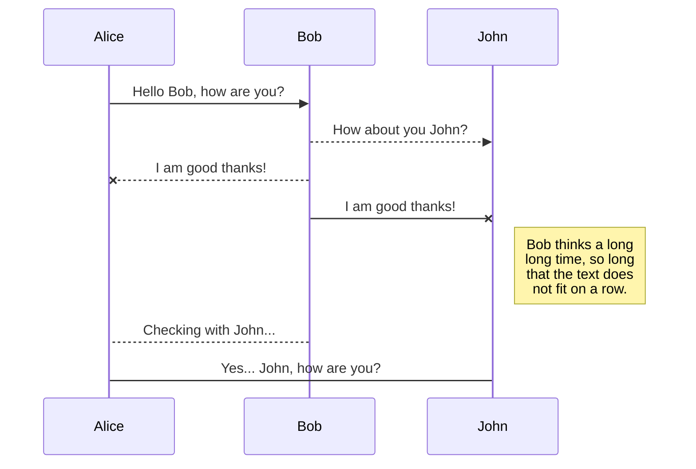
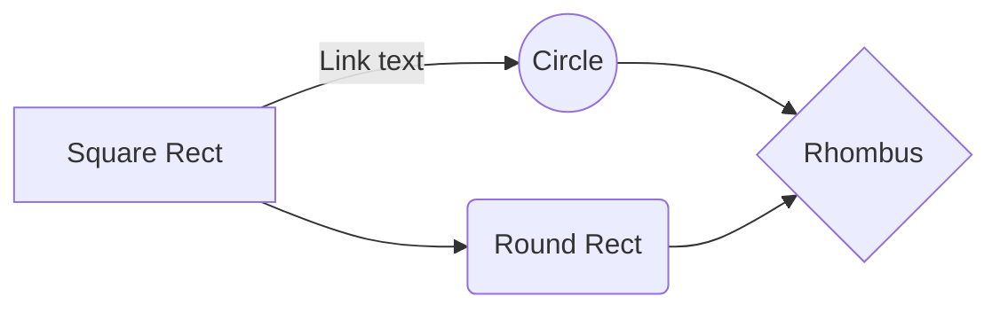

# Installation of vSphere on OCP4
# Pre-Reqs
This repository follows the following article.
[https://blog.openshift.com/deploying-a-user-provisioned-infrastructure-environment-for-openshift-4-1-on-vsphere/](https://blog.openshift.com/deploying-a-user-provisioned-infrastructure-environment-for-openshift-4-1-on-vsphere/)

Terraform 11.0.2
jq

git clone [https://github.com/hornjason/ocp4-vsphere](https://github.com/hornjason/ocp4-vsphere)

cd ocp4-vsphere
edit machine/ignition.tf;
change gw = "local gw"
change DNS1 = "dns server"

// ID identifying the cluster to create. Use your username so that resources created can be tracked back to you.
cluster_id = "example-cluster"

// Domain of the cluster. This should be "${cluster_id}.${base_domain}".
cluster_domain = "example-cluster.devcluster.openshift.com"
// Base domain from which the cluster domain is a subdomain.
base_domain = "devcluster.openshift.com"

// Name of the vSphere server. The dev cluster is on "vcsa.vmware.devcluster.openshift.com".
vsphere_server = "vcsa.vmware.devcluster.openshift.com"

// User on the vSphere server.
vsphere_user = "YOUR_USER@SSO.DOMAIN"

// Password of the user on the vSphere server.
vsphere_password = "YOUR_PASSWORD"

// Name of the vSphere cluster. The dev cluster is "devel".
vsphere_cluster = "devel"

// Name of the vSphere data center. The dev cluster is "dc1".
vsphere_datacenter = "dc1"

// Name of the vSphere data store to use for the VMs. The dev cluster uses "nvme-ds1".
vsphere_datastore = "nvme-ds1"

// Name of the vSphere folder that will be created and used to store all created objects.
vsphere_folder = "Folder Name"

// Name of the VM template to clone to create VMs for the cluster. The dev cluster has a template named "rhcos-latest".
vm_template = "rhcos-latest"

// The machine_cidr where IP addresses will be assigned for cluster nodes.
// Additionally, IPAM will assign IPs based on the network ID.  This is the network where VMs will live
machine_cidr = "10.0.0.0/24"

// The number of control plane VMs to create. Default is 3.
control_plane_count = 3

// The number of compute VMs to create. Default is 3.
compute_count = 3

// URL of the bootstrap ignition. This needs to be publicly accessible so that the bootstrap machine can pull the ignition.
bootstrap_ignition_url = "URL_FOR_YOUR_BOOTSTRAP_IGNITION"

// These are created by creating the install-config.yaml and running openshift-install create ignition-configs
// Ignition config for the control plane machines. You should copy the contents of the master.ign generated by the installer.
control_plane_ignition = <<END_OF_MASTER_IGNITION
Copy the master ignition generated by the installer here.
END_OF_MASTER_IGNITION

// Ignition config for the compute machines. You should copy the contents of the worker.ign generated by the installer.
compute_ignition = <<END_OF_WORKER_IGNITION
Copy the worker ignition generated by the installer here.
END_OF_WORKER_IGNITION

// Set ipam and ipam_token if you want to use the IPAM server to reserve IP
// addresses for the VMs.

// Address or hostname of the IPAM server from which to reserve IP addresses for the cluster machines.
//ipam = "139.178.89.254"

// Token to use to authenticate with the IPAM server.
//ipam_token = "TOKEN_FOR_THE_IPAM_SERVER"

// Set bootstrap_ip, control_plane_ip, and compute_ip if you want to use static
// IPs reserved someone else, rather than the IPAM server.

// The IP address to assign to the bootstrap VM.
// These are on the same network as 'machine_cidr'
bootstrap_ip = "10.0.0.10"

// The IP addresses to assign to the control plane VMs. The length of this list
// must match the value of control_plane_count.
control_plane_ips = ["10.0.0.20", "10.0.0.21", "10.0.0.22"]

// The IP addresses to assign to the compute VMs. The length of this list must
// match the value of compute_count.
compute_ips = ["10.0.0.30", "10.0.0.31", "10.0.0.32"]
`
## SmartyPants

SmartyPants converts ASCII punctuation characters into "smart" typographic punctuation HTML entities. For example:

|                |ASCII                          |HTML                         |
|----------------|-------------------------------|-----------------------------|
|Single backticks|`'Isn't this fun?'`            |'Isn't this fun?'            |
|Quotes          |`"Isn't this fun?"`            |"Isn't this fun?"            |
|Dashes          |`-- is en-dash, --- is em-dash`|-- is en-dash, --- is em-dash|

## KaTeX

You can render LaTeX mathematical expressions using [KaTeX](https://khan.github.io/KaTeX/):

The *Gamma function* satisfying $\Gamma(n) = (n-1)!\quad\forall n\in\mathbb N$ is via the Euler integral

$$
\Gamma(z) = \int_0^\infty t^{z-1}e^{-t}dt\,.
$$

> You can find more information about **LaTeX** mathematical expressions [here](http://meta.math.stackexchange.com/questions/5020/mathjax-basic-tutorial-and-quick-reference).

## UML diagrams

You can render UML diagrams using [Mermaid](https://mermaidjs.github.io/). For example, this will produce a sequence diagram:

And this will produce a flow chart:

<!--stackedit_data:
eyJoaXN0b3J5IjpbMTgwODgxNjkyNCw0NDA1MzI3MF19
-->